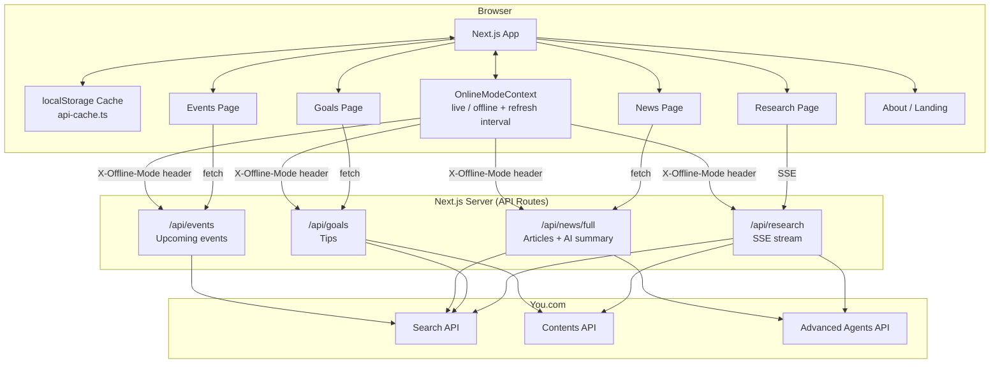
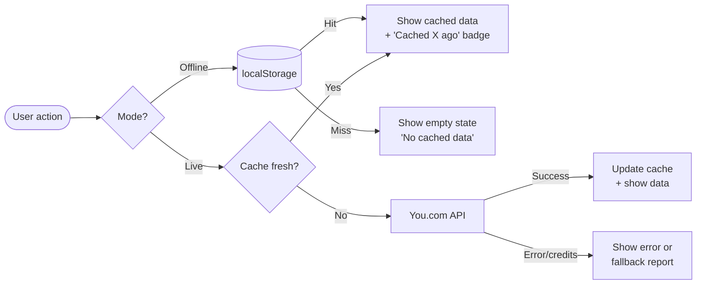
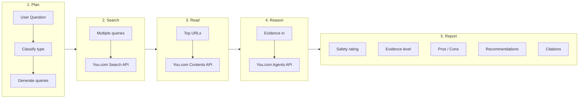
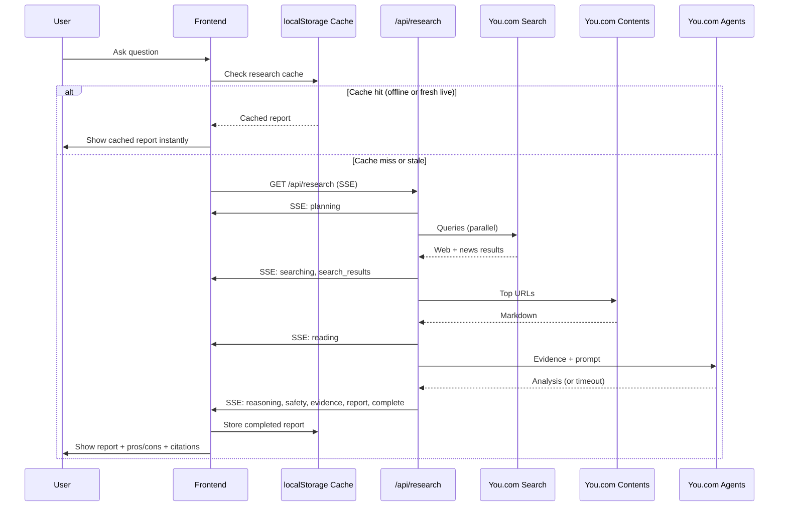

# Remedy — AI Health Research Agent

Remedy grounds health answers in **live web data** and returns **citation-backed reports** using You.com's Search, Contents, Live News, and Advanced Agents APIs. It combines creativity + reasoning + real data: an AI research partner that plans multi-step workflows, performs live research, explains complex health topics, and delivers structured evidence — with pros/cons, recommendations, and full citations. The reasoning process is visible in real-time.

---

## What Makes Remedy Different

Remedy is not just another medical chatbot. It is built for **evidence traceability**, **explainable reasoning**, and **clinical-grade output**:

- **Clinical Risk Engine** — Quantified interaction risk score (0–100) using evidence weighting, study size, and recency.
- **Multi-agent pipeline** — Research Agent → Verifier Agent → Safety Agent → Bias Auditor; each step is visible in the UI.
- **Source hierarchy** — FDA label > RCT > Meta-analysis > Observational > Blog; every citation is tiered.
- **Contraindication alerts** — Edge cases (pregnancy, pediatrics, polypharmacy, Crohn's, etc.) are called out when relevant.
- **Conflicting evidence** — When two sources disagree, the report highlights the conflict.
- **Reasoning checkpoints** — See which sources were rejected and why (reproducible query log).
- **Live / Offline Mode** — Switch between live You.com API fetches and cached data directly from the header; configurable refresh interval minimizes API usage.
- **Smart localStorage Cache** — Every API response is cached; Offline mode serves up to 7-day-old cached data; Live mode skips fresh cache to avoid redundant calls.

---

## Full Features

### Research (Research tab)

| Feature | Description |
|--------|-------------|
| **Multi-mode research** | Four modes: **Interaction** (drug/supplement combinations), **Supplement** (efficacy, dosage, safety), **Wellness** (diets, trends, claims), **General** (any health question). |
| **Real-time agent steps** | SSE streaming shows planning, searching, reading, and reasoning steps as they happen. |
| **Structured reports** | Safety rating, evidence level, **pros/cons**, **recommendations**, mechanism, and questions for your doctor. |
| **Clean report content** | Citation snippets (not raw HTML) used as primary source for Key Points and Pros/Cons — URL fragments, nav labels, and breadcrumbs are stripped before display. |
| **Research Summary sidebar** | Past research in latest order; click an entry for a **full report overlay** with analysis and sources. |
| **Citations** | Every claim linked to source; **source hierarchy** (FDA label, RCT, meta-analysis, observational, blog); DOI/PubMed when available. |
| **Risk score** | Quantified **clinical risk score** (0–100) from safety + evidence + citation count. |
| **Contraindication alerts** | Pregnancy, pediatrics, polypharmacy, Crohn's/IBD, etc., when evidence mentions them. |
| **Research cache** | Completed reports are cached; in Offline mode or when cache is fresh, the cached report is served immediately. Degraded (credits-unavailable) reports are never served from cache in Live mode. |
| **Research tab reset** | Clicking the Research nav item while on the Research page dispatches a custom event to clear the chat and start a fresh session. |
| **Export** | One-click download as text (physician share format). |

### Health Goals (Goals tab)

| Feature | Description |
|--------|-------------|
| **Goal tracking** | Create goals with title, category, target date, and progress. |
| **AI-powered tips** | Tips fetched via You.com Search + Contents; each tip includes **key highlights** (bullet points from articles). |
| **Tips cache** | Goal tips are cached per goal+category; served from cache in Offline mode or when cache is fresh in Live mode. |
| **Notifications** | Toasts for new tips; **Notifications sidebar** lists all tips with mark read, clear all, and delete. |

### News (News tab)

| Feature | Description |
|--------|-------------|
| **Category filters** | All, Medical, Fitness, Diet & Nutrition, Wellness. |
| **Time range** | Today, 3, 7, 14, or 30 days. |
| **AI summary** | Optional AI-generated summary of top headlines. |
| **Latest-first** | Articles sorted by recency. |
| **News cache** | Articles and summaries are cached; refreshed on a schedule in Live mode; served from cache in Offline mode with a "Cached X ago" badge. |
| **You.com Live News** | Powered by You.com Search API with `livecrawl: "news"`. |

### Events (Events tab)

| Feature | Description |
|--------|-------------|
| **Live events** | Upcoming health, fitness, and wellness events fetched live from You.com Search API. |
| **Category filters** | All, Health, Fitness, Wellness. |
| **Cited sources** | Every event card links to its original source — no uncited data. |
| **Events cache** | Events are cached per category; served from cache in Offline mode or when cache is fresh in Live mode with a "Cached X ago" badge. |
| **Empty state** | If no live data is available, a clear message is shown instead of mock data. |

### Live / Offline Mode

| Feature | Description |
|--------|-------------|
| **Mode selector** | Prominent Live / Offline segment control always visible in the header when logged in. |
| **Refresh interval** | In Live mode, choose how often to refetch: 30 min, 1 hr, 2 hr, or 4 hr. Fresh cache is served without an API call. |
| **Offline mode** | All pages serve cached data (up to 7 days old). API routes return early with an `offline: true` flag — no You.com API calls are made. |
| **Data mode bar** | Slim bar below the header shows current mode and refresh interval at a glance. |
| **Persistence** | Mode and refresh interval are stored in `localStorage` and restored on reload. |

### App-wide

| Feature | Description |
|--------|-------------|
| **Demo login** | Sign in with demo credentials; session persisted in `localStorage`. |
| **Light / dark mode** | Theme toggle in header; preference stored in `localStorage`. |
| **Rolling disclaimer** | Marquee medical disclaimer bar when logged in. |
| **Animated logo** | Framer Motion logo in header and landing. |
| **Responsive layout** | Sidebars collapse on smaller screens. |

---

## The Problem

People make health decisions based on bad information every day:

- 70% of Americans take supplements, most without checking interactions with their medications
- Drug interactions cause ~125,000 deaths per year in the US alone
- Wellness misinformation spreads faster than evidence-based research
- Doctors have 15-minute appointments — not enough time for thorough Q&A

---

## You.com API Integration

Remedy uses **You.com Search, Contents, Advanced Agents, and Live News**:

- **Search API** (`GET /v1/search`) — Targeted medical queries for research, goals, news, and events; freshness filters and livecrawl for enriched results
- **Live News** — Used for the **News** page via the Search API with `livecrawl: "news"`; fetches latest health, medical, fitness, diet, and wellness news with category and time-range filters and AI summary
- **Events** — Used for the **Events** page via the Search API with category-specific queries; returns upcoming health/fitness/wellness events with cited source links
- **Contents API** (`POST /v1/contents`) — Extract clean markdown from authoritative medical URLs for deep analysis
- **Advanced Agents API** (`POST /v1/agents/runs`) — Custom reasoning agent with **research** and **compute** tools; multi-step workflows, live research, and explained reasoning

---

## Hackathon tracks Remedy covers

| Track | How Remedy uses it |
|-------|--------------------|
| **AI-Powered Search Assistant** | Grounds every answer in live web data via the Search API; returns citation-backed answers for LLM grounding and real-time Q&A. |
| **Research Copilot** | Combines Agents API with Search and Compute tools to summarize, analyze, and cite papers, news, and medical sources—like an AI research partner. |
| **Insight Dashboard** | Uses Search, Live News, and Contents to track emerging health trends and insights; News page with category/time filters and AI summary. |
| **Custom Reasoning Agent** | Builds an agent that plans multi-step workflows, performs live research, and explains complex health topics using the Advanced Agents API. |
| **Live News Analyzer** | Pulls and summarizes latest health/medical headlines with the Live News API; auto-generated AI summary for a daily health briefing. |
| **Knowledge Copilot** | Chat assistant that answers any health question with up-to-date information, citations, and reasoning powered by You.com's APIs. |

---

## Architecture

### High-level system



### Live / Offline caching flow



### Research agent flow



### Agent data flow (sequence)



### Project structure

```
src/
├── app/
│   ├── layout.tsx              # Root layout — wraps OnlineModeProvider, AuthProvider, ThemeProvider
│   ├── page.tsx                # About / Landing page
│   ├── research/page.tsx       # Research chat page
│   ├── goals/page.tsx          # Health goals + AI tips
│   ├── news/page.tsx           # News feed (renamed from "Health News")
│   ├── events/page.tsx         # Upcoming health/fitness/wellness events (NEW)
│   ├── login/page.tsx
│   ├── register/page.tsx
│   └── api/
│       ├── research/route.ts   # SSE stream: plan → search → read → reason → report
│       ├── goals/route.ts      # Fetch AI tips for a goal
│       ├── news/route.ts       # Fetch news articles
│       ├── news/full/route.ts  # Fetch articles + AI summary
│       └── events/route.ts     # Fetch upcoming events (NEW)
│
├── components/
│   ├── Header.tsx              # Nav + Live/Offline segment control + refresh interval dropdown
│   ├── ChatInterface.tsx       # Research chat: cache logic, SSE streaming, reset event
│   ├── MessageBubble.tsx       # Report rendering with formatReportAnalysis cleanup
│   ├── NewsFeed.tsx            # Sidebar news feed with caching
│   ├── AppShell.tsx
│   ├── AnimatedLogo.tsx
│   └── ...
│
└── lib/
    ├── agent.ts                # Research pipeline: search → read → reason → buildSmartAnalysis
    ├── prompts.ts              # Agent prompt builder
    ├── you-client.ts           # You.com API client (search, contents, agents)
    ├── api-cache.ts            # localStorage cache: getCached, setCached, isCacheFresh (NEW)
    ├── online-mode-context.tsx # OnlineModeProvider: live/offline mode + refresh interval (NEW)
    ├── auth-context.tsx
    ├── theme-context.tsx
    ├── types.ts
    └── utils.ts                # formatReportAnalysis: clean markdown before rendering
```

---

## Tech Stack

| Layer | Technologies |
|-------|--------------|
| **Framework** | Next.js 16, React 19, TypeScript |
| **Styling** | Tailwind CSS v4, class-based dark mode |
| **Animations** | Framer Motion (logo, steps, modals, list) |
| **Markdown** | react-markdown, remark-gfm |
| **Icons** | Lucide React |
| **Streaming** | Server-Sent Events (SSE) |
| **State** | React Context (auth, theme, online mode), localStorage |
| **Caching** | Custom localStorage cache (`api-cache.ts`) with timestamps and TTL |
| **Deployment** | Docker (multi-stage), Vercel |

---

## Demo Flow for Judges

1. **Open the app** — note the `Live | Offline` control in the header. Mode and refresh interval persist across reloads.
2. **Start research** — ask a supplement or interaction question (e.g. "What are the benefits of omega-3 fatty acids?").
3. **Watch agent steps** — planning, searching, reading, reasoning stream in real-time via SSE.
4. **Review the report** — safety rating, risk score, pros/cons, recommendations, and cited sources.
5. **Reset research** — click the "Research" nav tab while on the Research page to clear the chat and start fresh.
6. **Switch to Offline** — set mode to Offline; revisit Research, Goals, News, Events — all serve cached data without any API calls.
7. **Check Events** — open the Events tab to see live, cited upcoming health and fitness events fetched from You.com.
8. **Check News** — open the News tab, filter by category and time range, toggle AI summary.
9. **Switch back to Live** — set a 30 min refresh interval; pages skip fresh cache, make a live API call, and update the cache.
10. **Goals** — create a goal, fetch AI tips, see the notifications sidebar.

---

## Quick Start

### Prerequisites

- Node.js 20+
- A You.com API key ([get one](https://you.com/platform))

### Run locally

```bash
git clone https://github.com/palsure/remedy.git
cd remedy

cp .env.example .env
# Edit .env and set YOU_API_KEY=your_key

npm install
npm run dev
# Open http://localhost:3000
```

### Run with Docker

```bash
git clone https://github.com/palsure/remedy.git
cd remedy

cp .env.example .env
# Edit .env and set YOU_API_KEY=your_key

docker compose up --build -d
# Open http://localhost:3000
```

### Demo login

- **Email:** `demo@remedy.health`
- **Password:** `demo1234`

---

## Environment Variables

| Variable | Required | Description |
|----------|----------|-------------|
| `YOU_API_KEY` | Yes | You.com API key for Search, Contents, and Agents APIs |

---

## Disclaimer

Remedy provides research-based information only. This is **not medical advice**. Always consult your healthcare provider before making medication or supplement changes.

---

## License

MIT

---

Built for the You.com Hackathon at DevWeek 2026.
